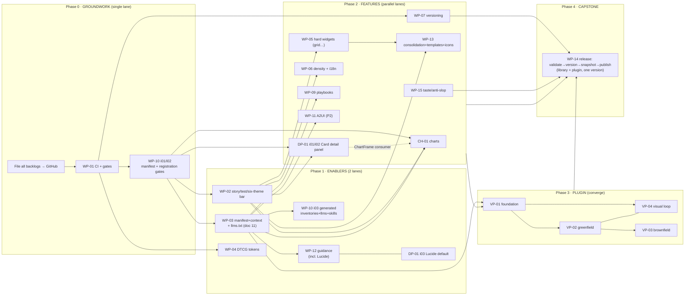

# 00 · MASTER BUILD ORDER — one instruction for a long-running multi-agent build

> **This is the single instruction.** It sequences the **four research packs** in `research/` into one
> continuous, multi-agent build that runs **to completeness** and only stops at the explicit human-gates
> listed in §6. Hand it to your orchestrating agent as-is.

## The one-paragraph kickoff (paste this to your agent)

> Execute `research/00-MASTER-BUILD-ORDER.md`. First do the **groundwork** (Phase 0): file all four
> backlogs to GitHub as epics/issues, then land WP-01 + WP-10 issue-01/02. Then implement the rest in the
> **phase order** below, running the **self-driving loop** (§5) continuously — pick the next _unblocked_
> issue, implement it, run its Definition-of-Done battery, open a PR that `Closes #N`, merge, tick the
> epic, move on. **Do not stop between items.** Only stop at the **human-gates in §6**. You may run
> **multiple agents in parallel** along the lanes in §4. **Done** = every epic's children closed, repo
> gates green, and the WP-14 release cut (library + plugin, one version). Reuse the substrate
> (manifest, playbooks, templates, gates); never hand-edit generated files — regenerate them. **End each
> larger building session** by running visual-review + the review agents on your _own_ changed work and
> `/session-retro` at completion (§5b).

## The blocks (what's being orchestrated)

| Block                                      | Folder                      | Backlog                                | Own runbook                                                                            |
| ------------------------------------------ | --------------------------- | -------------------------------------- | -------------------------------------------------------------------------------------- |
| **Enterprise-gap** (the substrate)         | `enterprise-gap/`           | WP-01…WP-15 (+ decision records 10–13) | [`enterprise-gap/00-HANDOVER.md`](./enterprise-gap/00-HANDOVER.md)                     |
| **Charts**                                 | `chart-components/`         | CH-01 (7 issues)                       | [`chart-components/01-integration-plan.md`](./chart-components/01-integration-plan.md) |
| **Detail panel + Lucide**                  | `interactive-detail-panel/` | DP-01 (3 issues)                       | [`interactive-detail-panel/README.md`](./interactive-detail-panel/README.md)           |
| **View transitions**                       | `view-transitions/`         | VT-01 (5 issues)                       | [`view-transitions/README.md`](./view-transitions/README.md)                           |
| **Component intake**                       | `component-intake/`         | EI-01 (3 issues)                       | [`component-intake/README.md`](./component-intake/README.md)                           |
| **Vibe-coder plugin** (the exposure layer) | `vibe-coder-plugin/`        | VP-01…VP-04                            | [`vibe-coder-plugin/00-HANDOVER.md`](./vibe-coder-plugin/00-HANDOVER.md)               |

**Mental model:** enterprise-gap is the **foundation + substrate**; charts, the detail-panel, and view transitions are
**library features** built on it; the plugin is the **exposure layer** that packages everything for
end-users; the release pipeline is the **capstone** that ships library + plugin together.

## 1. Is there groundwork? Yes — two kinds, both first

1. **Track before you build** (both handovers' phase 1+2, the repo's _finders report, builders fix_ rule):
   create every backlog item as a **GitHub epic/issue** with labels + epic↔child task lists + a project
   board, in the order below. No implementation PR exists without its issue. _(One-time.)_
2. **The enforcement keystone — WP-01 then WP-10 issue-01/02.** WP-01 (CI + quality gates + doc-truth)
   **unblocks everything**; WP-10 issue-01/02 (manifest auto-regen + stale-gate, component-registration
   gate) deliver your "no reminders" ask immediately and make every later component **born-compliant**.
   **Nothing else starts until this is green.**

Everything after groundwork is "born compliant" because the gates exist to enforce it.

## 2. The dependency graph

_(WP-08 Figma Code Connect is optional/deferred — start only if design-to-code becomes a requirement;
depends on WP-04.)_

## 3. The phase order (what, and why this order)

| Phase              | Work (in order)                                                                                                                         | Why here                                                                                                                                                           |
| ------------------ | --------------------------------------------------------------------------------------------------------------------------------------- | ------------------------------------------------------------------------------------------------------------------------------------------------------------------ |
| **0 · Groundwork** | File backlogs → GitHub · **WP-01** · **WP-10 i01/i02**                                                                                  | CI + gates are the keystone; everything else relies on them. **Single lane.**                                                                                      |
| **1 · Enablers**   | **WP-03** (+ doc-11 `llms.txt`) ∥ **WP-02** → **WP-10 i03** · **WP-12** authoring · **WP-04** · **DP-01 i03 (Lucide)**                  | The manifest/context/`llms.txt` + the coverage bar unlock the agentic surface + the plugin. Lucide is a repo-wide default → land early (feeds WP-12 + the plugin). |
| **2 · Features**   | **CH-01** ∥ **DP-01 i01/i02** ∥ **VT-01** (after DP-01) ∥ **EI-01** ∥ **WP-05 + WP-13 + WP-06** ∥ **WP-09 + WP-15 + WP-11** + **WP-07** | The bulk of net-new, on different packages → **parallelize** (see §4).                                                                                             |
| **3 · Plugin**     | **VP-01** → **VP-02 + VP-04** (together) → **VP-03**                                                                                    | The exposure layer; consumes WP-03/09/13/05/12 + CH-01 + DP-01. Build after the features are solid.                                                                |
| **4 · Capstone**   | **WP-14** (with **WP-07** versioning in place)                                                                                          | One release gate runs everything's checks and ships **library + plugin together**. **Last. Single lane.**                                                          |

## 4. Can you run multiple agents? Yes — lanes by package

After Phase 0 (which is **single-lane** — it touches shared infra: CI, hooks, gates), fan out. The safe
rule: **one lane owns one package/area at a time** (low file-collision), converge at integration points.

| Lane                  | Owns (packages)                                                                 | Work                                                            |
| --------------------- | ------------------------------------------------------------------------------- | --------------------------------------------------------------- |
| **A — Agent surface** | `@qlik-coe-emea/qlabs-components-cli`, manifest, `skills/`, `themes.css` tokens | WP-03, WP-10 i03, WP-12, WP-04, WP-06                           |
| **B — Charts**        | `@qlik-coe-emea/qlabs-components-charts`, `themes.css` chart tokens             | CH-01 (all 7 issues)                                            |
| **C — Core UI**       | `@qlik-coe-emea/qlabs-components-ui`, `@qlik-coe-emea/qlabs-components-icons`   | DP-01 (panel + Lucide), WP-13 consolidation, WP-05 hard widgets |
| **D — Compose/AI**    | `@qlik-coe-emea/qlabs-components-ai`, playbooks, audit                          | WP-09, WP-15, WP-11                                             |
| **E — Plugin**        | `vibe-coder-plugin`                                                             | VP-01→VP-02+VP-04→VP-03 (starts once Lane A's WP-03 is live)    |

**Parallelism discipline (critical):**

- **Never hand-merge generated files** (`brand-ui.manifest.json`, `llms.txt`, the `context`/inventory
  blocks, skill catalogue regions). On conflict, **re-run the generator** — the WP-10 stale-gate is the
  arbiter. This is why WP-03/WP-10 come _before_ the parallel feature phase.
- **Shared-file serialization:** `themes.css` (tokens), and the generated blocks in
  `CLAUDE.md`/`AGENTS.md` are touched by several lanes — route token changes through **Lane A** or rebase
  frequently; regenerate the blocks rather than editing.
- **One issue = one PR = one merge**, rebased on the latest default branch; tick the epic checkbox on
  merge. Lanes converge into Phase 3 (plugin) and Phase 4 (release).

## 5. The self-driving loop (the "don't stop" protocol)

Run this continuously per lane. **Do not pause between items** — only the §6 gates stop you.

1. **Pick** the next **unblocked** issue in your lane (deps merged, `needs-run` confirmable). If blocked,
   take the next unblocked one; never idle-wait.
2. **Confirm readiness** — check the issue's `needs-run` notes + "Depends on". If an assumption is wrong,
   **re-scope the issue** (comment, don't force) and move on.
3. **Branch** `feat/<wp|ch|dp|vp>-NN-<slug>` off the default branch.
4. **Implement to the acceptance criteria**, reusing the substrate (manifest, playbooks, templates,
   gates, existing `@qlik-coe-emea/qlabs-components-*` primitives — never re-vendor what exists).
5. **Run the Definition-of-Done battery** (from `.claude/rules/quality-gates.md`): full-repo
   `pnpm typecheck lint test build`; for UI → `/review-component` + accessibility + the **six-theme
   `brand-ui-audit`**; for registry/manifest touches → `registry:validate` + `pnpm manifest` (stale-gate);
   **for any token/theme touch → the theme-token parity gate + six-theme contrast re-audit (WP-10
   issue-05)**; add the issue's "Test to add". **Review precedes merge.**
6. **Open the PR** `Closes #N`, fill the template, link the epic. Keep PRs small (one issue). For VP-03
   migration: one PR per migration phase, app green each.
7. **Merge → tick the epic checkbox → go to step 1.**

Operating principles carried into every item: **finders report, builders fix** (issue exists before the
PR); **enforcement over reminders** (an item isn't done until its rule is wired into a generator + gate);
**reuse over duplicate**; **born-compliant** (passes the WP-10 gates + six-theme audit, semantic tokens
only); **link context, don't copy it**.

## 5b. Session cadence — self-review after larger sessions + retro at completion

The §5 loop reviews **each item**. This adds the **session-level** checkpoints (the machinery already
exists — `/visual-review`, `visual-ux-reviewer` + `accessibility-reviewer` agents, `/session-retro` +
`session-reviewer`; it just isn't auto-triggered today, so WP-10 issue-04 wires a bounded Stop/SessionEnd
nudge). Each lane:

- **After a larger building session** (several components/charts/tokens/stories changed — not every tiny
  PR): run **`/visual-review` + the `visual-ux-reviewer` and `accessibility-reviewer` agents against your
  own changed work** across the six themes — the agent critiques what it just built, on the **real
  rendered surface** (Storybook), not from memory. File findings via **`/file-issue`** (finders report,
  builders fix); fix P0s before moving on.
- **At session completion**, run **`/session-retro`** — a fresh `session-reviewer` reads the on-disk
  transcript for skipped steps / shortcuts / needed corrections, files `meta`/`type:process` issues, and
  hardens governance (rules + hooks) so the same miss can't recur. This is **required to "wrap" a
  session**, not optional.
- **In a multi-agent run**, each lane self-reviews its own surfaces; the **orchestrator runs one
  `/session-retro` for the whole session** so cross-lane process issues are caught once.

This is enforced (nudged) by the WP-10 issue-04 Stop/SessionEnd hook — but treat it as a standing rule:
**big session ⇒ visual + a11y self-review of your own work, then `/session-retro`.**

## 6. The ONLY legitimate stop points (otherwise: keep going)

Stop and ask the human **only** for these. Everything else, proceed.

- **One-time setup:** confirm the **target GitHub repo** + create **labels** (Step 0); confirm the
  **LATER-phase issue granularity** (inline-in-epic vs split — see enterprise-gap handover §worklist) and
  the **VP-04 / WP-04/05/06/07 inline-issue** granularity.
- **The few real design forks (`needs-run`):** CH-01 Phase-0 spike — the **visx alpha-pin vs stable-visx**
  and **forwardRef-vs-charts-rule** decisions (decide in the spike, then proceed). _(DP-01's forks are
  already decided: enhance-Card-directly + fixed-footprint hover; Lucide is decided.)_
- **Prohibited / irreversible actions — always stop and have the human do it:** publishing/releasing
  (WP-14 `publish` + the marketplace push), anything needing **secrets/tokens**, force-pushes, deleting
  data. The agent prepares the release and **stops at the publish step** for approval.
- **A genuine blocker:** a dependency truly isn't ready, or a `needs-run` proves an assumption false →
  re-scope the issue, pick the next unblocked item (don't force, don't stop the whole run).
- **Out of band (not a stop):** the **charts license** is handled maintainer↔author — assume the grant is
  in place and proceed.

If it's not in this list, the agent keeps going.

## 7. Definition of done (completeness)

- **Tracking:** every backlog item is a GitHub epic/issue; every implementing PR `Closes #N`; boards
  reflect the phase/dependency order.
- **Substrate:** WP-01 CI green; WP-10 gates live (manifest + registration + **generated-inventories /
  `llms.txt` / skill-catalogue stale-gate**, per doc 11; **+ the theme-token parity gate, issue-05**);
  WP-03 manifest enriched + `context` + **`llms.txt` hub+spokes** generated; WP-02 coverage bar met
  (stories/tests/**six-theme AA artifact**); WP-12 guidance generated + gated.
- **Themes serve everything:** every theme defines every token (parity gate green); every new
  component/chart token is present + AA-legible in all six themes.
- **Self-review ran:** each larger building session ended with visual + a11y review of the changed work
  and a `/session-retro` (findings filed); the cadence nudge (WP-10 issue-04) is wired.
- **Features:** CH-01 (14 charts + `ChartFrame` expand/flip/CSV, reuse-audit clean, six-theme AA);
  DP-01 (Card detail panel + Lucide default + icon gate); WP-05/06/13 widgets/density/consolidation;
  WP-04 DTCG; WP-09 playbooks; WP-15 taste; WP-11 A2UI (if in scope); WP-07 versioning.
- **Plugin:** VP-01 foundation installs/runs (Cowork + Code); `new-app` + visual loop + `migrate` work,
  consuming the substrate.
- **Capstone:** **WP-14** cuts a release — validate gate green, **library + plugin one coordinated
  version**, `release/<version>/` snapshot, published (human-approved).

The run is **complete** when all epics' child checkboxes are ticked and a WP-14 release is cut.

## 8. Model tiering (cost-optimal)

Spend capability where mistakes compound and there are **no guardrails** (planning, architecture, root
cause); economize where the **gates already catch errors** (per-issue build is fenced by
typecheck/lint/test/six-theme/`/review-component`). Default the run to **Sonnet 4.6** (workhorse),
escalate to **Opus 4.8** for the brain, drop to **Haiku 4.5** for the chores.

Prices /MTok (in/out), checked 2026-06-06: **Opus 4.8** $5/$25 · **Sonnet 4.6** $3/$15 · **Haiku 4.5**
$1/$5. Note Opus is now only ≈**1.7×** Sonnet (not 5×); batch API −50% and cheap prompt-cache reads make
a long, re-reading run cheaper than the sticker rates.

**Wired per-subagent** (`.claude/agents/*.md` `model:`):

| Model      | Agents                                                                                                                     | Why                                                                                                      |
| ---------- | -------------------------------------------------------------------------------------------------------------------------- | -------------------------------------------------------------------------------------------------------- |
| **opus**   | `root-cause-analyst`, `design-system-architect`                                                                            | decide true root cause / structural API + token + package architecture — no guardrails, mistakes ripple. |
| **sonnet** | `component-builder`, `docs-writer`, `registry-curator`, `visual-ux-reviewer`, `accessibility-reviewer`, `session-reviewer` | build to spec + judgment reviews (visual/a11y/process); fenced by the gates.                             |
| **haiku**  | the **hooks/CLI tier**, not a subagent: gate scripts, manifest/`llms.txt` regen, link/verify, format                       | high-frequency mechanical loop steps. `registry-curator`/`docs-writer` can drop here if cost-tight.      |

**Orchestrator** (the session driving this runbook — a runtime choice, not an agent file): **Opus 4.8**
if you're running it mostly **unsupervised/overnight** (the small premium avoids expensive
wrong-architecture rework); **Sonnet 4.6** if you're **watching it**. The judgment-heavy _design forks_
in §6 (e.g. the CH-01 visx spike) warrant Opus regardless.

---

_Orchestrates: [`enterprise-gap/`](./enterprise-gap/) (WP-01…15 + decision records
[`10`](./enterprise-gap/10-soft-skill-adoption.md), [`11`](./enterprise-gap/11-agent-docs-architecture.md)) ·
[`chart-components/`](./chart-components/) (CH-01) · [`interactive-detail-panel/`](./interactive-detail-panel/)
(DP-01) · [`view-transitions/`](./view-transitions/) (VT-01) · [`component-intake/`](./component-intake/) (EI-01) · [`vibe-coder-plugin/`](./vibe-coder-plugin/) (VP-01…04). Per-pack mechanics live in each pack's
own `00-HANDOVER`/README; this file only sets cross-pack order, parallelism, and the run loop._
